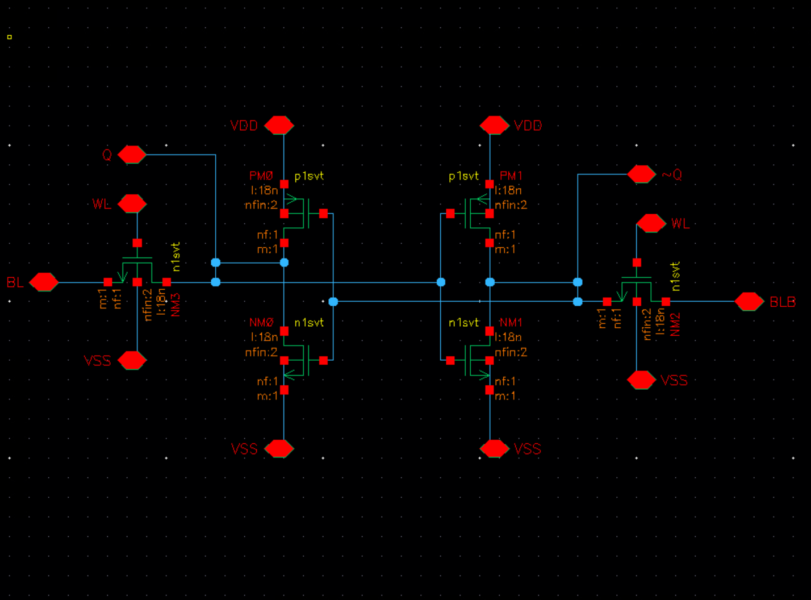

# SRAM-Based 4-bit MAC Accelerator - ESE 5700 (MSE EE - UPENN)

[](https://github.com/tmarhguy/mac-unit/actions/workflows/latex-to-pdf.yml)
[](https://github.com/tmarhguy/mac-unit)
[](https://github.com/tmarhguy/mac-unit)
[](https://github.com/tmarhguy/mac-unit)
[](https://github.com/tmarhguy/mac-unit)

<p align="center">
  
  <br>
  <em>The actual design — 6T SRAM bitcell schematic (`proj1_lib` 6t-sram) in Virtuoso.</em>
</p>

<p align="center">
  <a href="https://github.com/tmarhguy"></a>
  <a href="https://github.com/vwanjohi"></a>
  <a href="https://tmarhguy.github.io/mac-unit/"></a>
</p>

**ESE 5700 — Digital Integrated Circuits and VLSI Fundamentals** (University of Pennsylvania). Project 1: an SRAM-based 4-bit multiply-accumulate (MAC) accelerator in the **Cadence GPDK 18 nm** Virtuoso / Spectre flow.

**This GitHub repository is not the official Gradescope submission.** It is a shared archive for LaTeX sources, figures, and CI-built PDFs. Each part is uploaded separately to Gradescope as one team PDF.

**Course handout (in-repo):** [docs/ese5700-project1.pdf](docs/ese5700-project1.pdf).

## Docs

- [Report site](https://tmarhguy.github.io/mac-unit/) — the running
  report, built from [`docs/index.adoc`](docs/index.adoc) with `make docs`
- [architecture](docs/architecture.md) — design and build order
- [ADRs](docs/adr/) — sizing and signoff decisions

## Team

| Member | Role |
|--------|------|
| **Tyrone Marhguy** | Co-author |
| **Victor Wanjohi** | Co-author |

This is a **two-person team**. Each Gradescope report lists both members and delineates contributions. Both teammates are responsible for understanding the full design and report for every part.

## Project overview

The unit computes a 16-element dot product of 4-bit unsigned weights and activations:

$$
\mathrm{ACC} = \sum_{i=0}^{15} W[i] \cdot X[i]
$$

using two **16 × 4** SRAM macros, a 4×4 multiplier, a 12-bit accumulator, and a sequencer. The course splits the work into three graded parts; **this repo currently tracks Part 1 only**.

| Part | Deliverable | Due | In repo |
|------|-------------|-----|---------|
| **1** | 6T SRAM bitcell: schematic, custom layout, post-layout stability | 9/29/2026 | yes |
| **2** | Bitcell tiled into a 16 × 4 synchronous SRAM macro | 10/6/2026 | later |
| **3** | Two SRAMs + datapath + sequencer → MAC unit | 10/20/2026 | later |

Technology: **Cadence GPDK 18 nm** process, Virtuoso schematic/layout, Spectre/ADE, DRC/LVS/PEX. Nominal $V_{DD} = 1.2\,\mathrm{V}$.

## Repository layout

| Path | Description |
|------|-------------|
| [ESE5700_Proj1_Part1.tex](ESE5700_Proj1_Part1.tex) | Joint team Part 1 report source |
| [ESE5700_Proj1_Part1.pdf](ESE5700_Proj1_Part1.pdf) | CI-built PDF (after the workflow runs) |
| [docs/ese5700-project1.pdf](docs/ese5700-project1.pdf) | Official project handout |
| [media/](media/) | Part 1 figures and README assets |
| [scripts/](scripts/) | Local helpers: TeX container + docs builder (`build-docs.sh`) |
| [.github/workflows/](.github/workflows/) | LaTeX → PDF + Docs (GitHub Pages) workflows |
| [docs/index.adoc](docs/index.adoc) | Technical manual source (Asciidoctor book) |

## Build the manual locally

Requirements: Asciidoctor (`brew install asciidoctor`), or `apt-get install asciidoctor` on Linux. No npm needed.

```bash
make docs
make docs-open   # serve build/docs on :8000
```

## Build the report locally

Requirements: a modern TeX distribution with `latexmk`, or Docker/Podman for the containerized helper.

Native build:

```bash
latexmk -pdf -file-line-error -halt-on-error -interaction=nonstopmode ESE5700_Proj1_Part1.tex
```

Containerized build matching CI:

```bash
./scripts/run-latex-ci-local.sh
```

## Continuous Integration

The [LaTeX to PDF](.github/workflows/latex-to-pdf.yml) workflow runs on pushes to `main`/`master` when `ESE5700_Proj1_Part1.tex`, `media/**`, or the workflow itself changes. It compiles Part 1 and commits the PDF with `[skip ci]`.

Manual runs: **Actions → LaTeX to PDF → Run workflow**. Until the workflow has succeeded at least once, the badge may show no status and the PDF links may be missing.

## Academic integrity

This work is completed under the **University of Pennsylvania Code of Academic Integrity**. The repository archives our own materials and is not a substitute for Gradescope submission.

## Contact

**Victor Wanjohi**

[](mailto:vwanjohi@engineering.upenn.edu)
[](https://www.linkedin.com/in/victorwanjohi1/)

**Tyrone Marhguy**

[](mailto:tmarhguy@engineering.upenn.edu)
[](https://www.linkedin.com/in/tmarhguy/)


